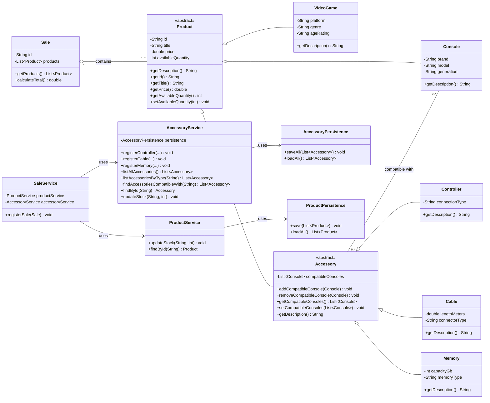

# Accessory Module — Class Diagram

```mermaid
classDiagram
    direction LR

    class Product {
        <<abstract>>
        -String id
        -String title
        -double price
        -int availableQuantity
        +getDescription() String
        +getId() String
        +getTitle() String
        +getPrice() double
        +getAvailableQuantity() int
        +setAvailableQuantity(int) void
    }

    class Console {
        -String brand
        -String model
        -String generation
        +getDescription() String
    }

    class VideoGame {
        -String platform
        -String genre
        -String ageRating
        +getDescription() String
    }

    class Accessory {
        <<abstract>>
        -List~Console~ compatibleConsoles
        +addCompatibleConsole(Console) void
        +removeCompatibleConsole(Console) void
        +getCompatibleConsoles() List~Console~
        +setCompatibleConsoles(List~Console~) void
        +getDescription() String
    }

    class Controller {
        -String connectionType
        +getDescription() String
    }

    class Cable {
        -double lengthMeters
        -String connectorType
        +getDescription() String
    }

    class Memory {
        -int capacityGb
        -String memoryType
        +getDescription() String
    }

    class Sale {
        -String id
        -List~Product~ products
        +getProducts() List~Product~
        +calculateTotal() double
    }

    class ProductService {
        +updateStock(String, int) void
        +findById(String) Product
    }

    class AccessoryService {
        -AccessoryPersistence persistence
        +registerController(...) void
        +registerCable(...) void
        +registerMemory(...) void
        +listAllAccessories() List~Accessory~
        +listAccessoriesByType(String) List~Accessory~
        +findAccessoriesCompatibleWith(String) List~Accessory~
        +findById(String) Accessory
        +updateStock(String, int) void
    }

    class SaleService {
        -ProductService productService
        -AccessoryService accessoryService
        +registerSale(Sale) void
    }

    class AccessoryPersistence {
        +saveAll(List~Accessory~) void
        +loadAll() List~Accessory~
    }

    class ProductPersistence {
        +save(List~Product~) void
        +loadAll() List~Product~
    }

    Product <|-- Console
    Product <|-- VideoGame
    Product <|-- Accessory

    Accessory <|-- Controller
    Accessory <|-- Cable
    Accessory <|-- Memory

    Accessory "0..*" -- "0..*" Console : compatible with

    Sale "1" o-- "1..*" Product : contains

    SaleService --> ProductService : uses
    SaleService --> AccessoryService : uses
    AccessoryService --> AccessoryPersistence : uses
    ProductService --> ProductPersistence : uses
```
