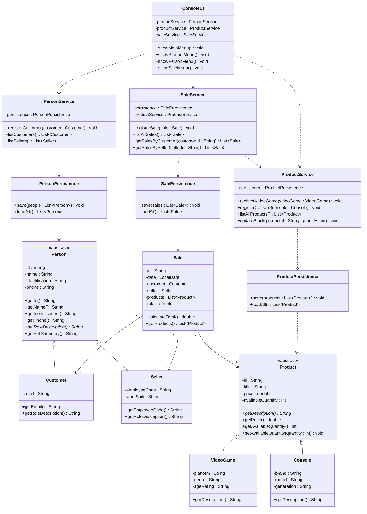

# Class Diagram - GameZone Unicesar

## Notes
In this diagram, dependency relationships between layers are indicated with dashed arrows (..>), following the strict architectural direction: UI → Service → Persistence → Model. Solid arrows (-->) denote associations exclusively within the model layer. Abstract elements—including the Person and Product base classes and the getDescription() method—are marked accordingly, maintaining consistency with the hierarchy diagram
