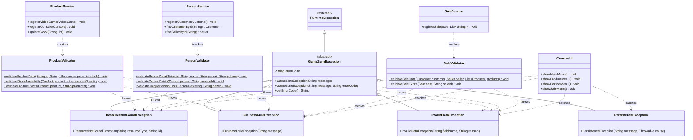

# Exception Handling & Validation Class Diagram (Requirement 6)

```mermaid
classDiagram
    direction TB

    %% Exception Hierarchy
    class RuntimeException {
        <<external>>
    }

    class GameZoneException {
        <<abstract>>
        -String errorCode
        +GameZoneException(String message)
        +GameZoneException(String message, String errorCode)
        +getErrorCode() String
    }

    class ResourceNotFoundException {
        +ResourceNotFoundException(String resourceType, String id)
    }

    class BusinessRuleException {
        +BusinessRuleException(String message)
    }

    class InvalidDataException {
        +InvalidDataException(String fieldName, String reason)
    }

    class PersistenceException {
        +PersistenceException(String message, Throwable cause)
    }

    RuntimeException <|-- GameZoneException
    GameZoneException <|-- ResourceNotFoundException
    GameZoneException <|-- BusinessRuleException
    GameZoneException <|-- InvalidDataException
    GameZoneException <|-- PersistenceException

    %% Validators Layer
    class ProductValidator {
        +validateProductData(String id, String title, double price, int stock)$ void
        +validateStockAvailability(Product product, int requestedQuantity)$ void
        +validateProductExists(Product product, String productId)$ void
    }

    class PersonValidator {
        +validatePersonData(String id, String name, String email, String phone)$ void
        +validatePersonExists(Person person, String personId)$ void
        +validateUniquePerson(List~Person~ existing, String newId)$ void
    }

    class SaleValidator {
        +validateSaleData(Customer customer, Seller seller, List~Product~ products)$ void
        +validateSaleExists(Sale sale, String saleId)$ void
    }

    %% Service Layer
    class ProductService {
        +registerVideoGame(VideoGame) void
        +registerConsole(Console) void
        +updateStock(String, int) void
    }

    class PersonService {
        +registerCustomer(Customer) void
        +findCustomerById(String) Customer
        +findSellerById(String) Seller
    }

    class SaleService {
        +registerSale(Sale, List~String~) void
    }

    %% UI Presentation Layer
    class ConsoleUI {
        +showMainMenu() void
        +showProductMenu() void
        +showPersonMenu() void
        +showSaleMenu() void
    }

    %% Relationships
    ProductService ..> ProductValidator : invokes
    PersonService ..> PersonValidator : invokes
    SaleService ..> SaleValidator : invokes

    ProductValidator ..> InvalidDataException : throws
    ProductValidator ..> BusinessRuleException : throws
    ProductValidator ..> ResourceNotFoundException : throws

    PersonValidator ..> InvalidDataException : throws
    PersonValidator ..> BusinessRuleException : throws
    PersonValidator ..> ResourceNotFoundException : throws

    SaleValidator ..> InvalidDataException : throws
    SaleValidator ..> BusinessRuleException : throws
    SaleValidator ..> ResourceNotFoundException : throws

    ConsoleUI ..> ResourceNotFoundException : catches
    ConsoleUI ..> BusinessRuleException : catches
    ConsoleUI ..> InvalidDataException : catches
    ConsoleUI ..> PersistenceException : catches
```
