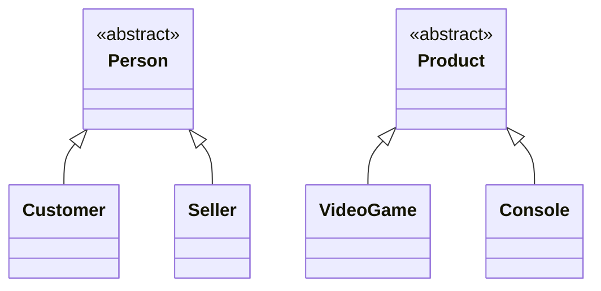

# Hierarchy Diagram

This diagram represents the inheritance relationships identified in the domain model.
It shows only generalization/specialization relationships, without attributes, methods, or associations.

## Notes
- `Person` and `Product` are abstract classes: they cannot be instantiated directly, since they only exist to group common characteristics of their subclasses.
- `Customer`, `Seller`, `VideoGame`, and `Console` are concrete classes.
- Both hierarchies belong exclusively to the `model` layer.
