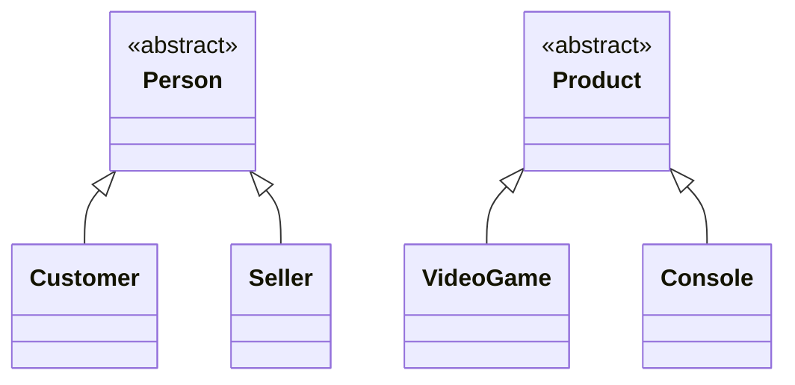

# Hierarchy Diagram

This diagram illustrates the hierarchical structure of the domain classes, focusing exclusively on inheritance relationships. It does not include details such as attributes, methods, or associations between classes

## Notes
The classes Person and Product are declared as abstract, meaning they cannot be instantiated directly. Their sole purpose is to encapsulate shared attributes and behavior for their respective subclasses. In contrast, Customer, Seller, VideoGame, and Console are concrete classes that can be instantiated. Both hierarchies are confined to the model layer
