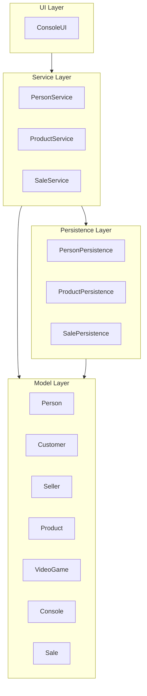

# Layers Diagram - GameZone Unicesar

## Notes
- Dependencies follow the mandatory direction: UI → Service → Persistence → Model.
- The Model layer has no outgoing dependencies to any other layer, keeping the domain independent.
- UI never accesses Persistence directly; all persistence operations must go through Service.
