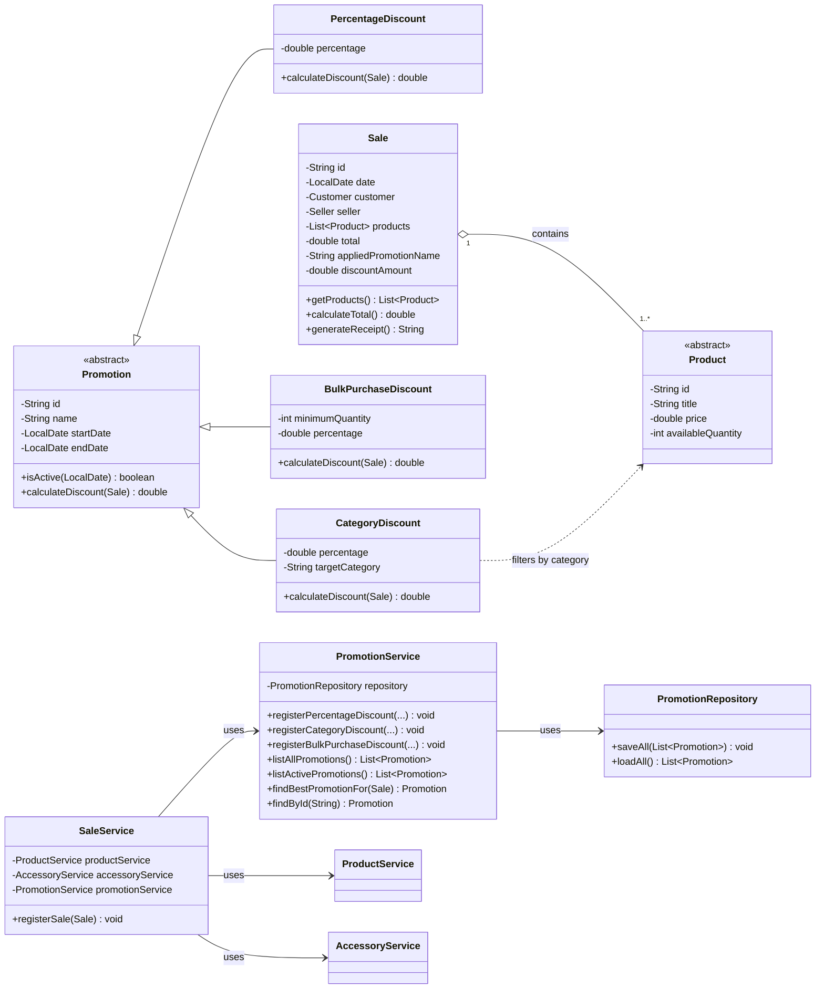

# Promotion Module — Class Diagram

```mermaid
classDiagram
    direction LR

    class Promotion {
        <<abstract>>
        -String id
        -String name
        -LocalDate startDate
        -LocalDate endDate
        +isActive(LocalDate) boolean
        +calculateDiscount(Sale) double
    }

    class PercentageDiscount {
        -double percentage
        +calculateDiscount(Sale) double
    }

    class CategoryDiscount {
        -double percentage
        -String targetCategory
        +calculateDiscount(Sale) double
    }

    class BulkPurchaseDiscount {
        -int minimumQuantity
        -double percentage
        +calculateDiscount(Sale) double
    }

    class Sale {
        -String id
        -LocalDate date
        -Customer customer
        -Seller seller
        -List~Product~ products
        -double total
        -String appliedPromotionName
        -double discountAmount
        +getProducts() List~Product~
        +calculateTotal() double
        +generateReceipt() String
    }

    class PromotionRepository {
        +saveAll(List~Promotion~) void
        +loadAll() List~Promotion~
    }

    class PromotionService {
        -PromotionRepository repository
        +registerPercentageDiscount(...) void
        +registerCategoryDiscount(...) void
        +registerBulkPurchaseDiscount(...) void
        +listAllPromotions() List~Promotion~
        +listActivePromotions() List~Promotion~
        +findBestPromotionFor(Sale) Promotion
        +findById(String) Promotion
    }

    class SaleService {
        -ProductService productService
        -AccessoryService accessoryService
        -PromotionService promotionService
        +registerSale(Sale) void
    }

    class Product {
        <<abstract>>
        -String id
        -String title
        -double price
        -int availableQuantity
    }

    Promotion <|-- PercentageDiscount
    Promotion <|-- CategoryDiscount
    Promotion <|-- BulkPurchaseDiscount

    Sale "1" o-- "1..*" Product : contains
    CategoryDiscount ..> Product : filters by category

    SaleService --> PromotionService : uses
    SaleService --> ProductService : uses
    SaleService --> AccessoryService : uses
    PromotionService --> PromotionRepository : uses
```

