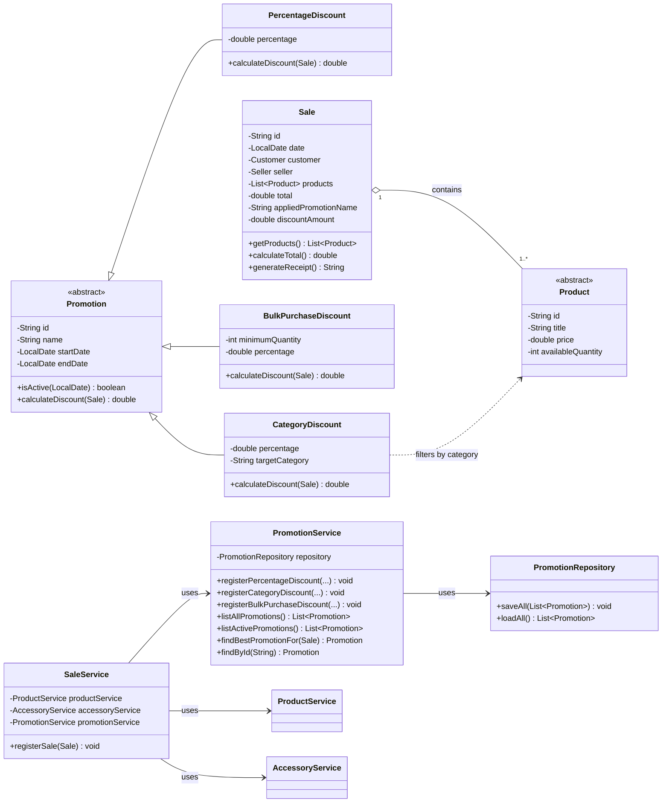

# Promotion Module — Class Diagram

This diagram shows the promotion module integrated with the existing GameZone
Unicesar system. It covers the promotion hierarchy, the persistence and service
classes, and the integration with sales.

## Notes

- `Promotion` is abstract and declares `calculateDiscount(Sale)` as an abstract
  method. Each subclass provides its own calculation rule.
- `PercentageDiscount` applies a percentage to the whole sale total.
- `CategoryDiscount` applies a percentage only to the products that match the
  target category (`VIDEOGAME` or `CONSOLE`).
- `BulkPurchaseDiscount` applies a percentage to the whole sale only when the
  sale contains at least `minimumQuantity` products.
- `Sale` is extended additively with `appliedPromotionName` and
  `discountAmount`, so the receipt can show the applied discount.
- `PromotionService.findBestPromotionFor(Sale)` selects the active promotion
  that yields the highest monetary discount. Only one promotion is applied per
  sale, and promotions are not cumulative.
- `PromotionRepository` persists promotions in `data/promotions.csv` using a
  type discriminator (`PERCENTAGE`, `CATEGORY`, `BULK`).
