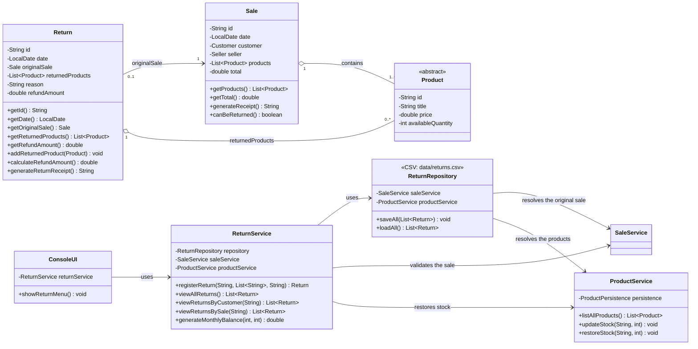

# Return Module — Class Diagram

```mermaid
classDiagram
    direction LR

    class Return {
        -String id
        -LocalDate date
        -Sale originalSale
        -List~Product~ returnedProducts
        -String reason
        -double refundAmount
        +getId() String
        +getDate() LocalDate
        +getOriginalSale() Sale
        +getReturnedProducts() List~Product~
        +getRefundAmount() double
        +addReturnedProduct(Product) void
        +calculateRefundAmount() double
        +generateReturnReceipt() String
    }

    class Sale {
        -String id
        -LocalDate date
        -Customer customer
        -Seller seller
        -List~Product~ products
        -double total
        +getProducts() List~Product~
        +getTotal() double
        +generateReceipt() String
        +canBeReturned() boolean
    }

    class ReturnRepository {
        <<CSV: data/returns.csv>>
        -SaleService saleService
        -ProductService productService
        +saveAll(List~Return~) void
        +loadAll() List~Return~
    }

    class ReturnService {
        -ReturnRepository repository
        -SaleService saleService
        -ProductService productService
        +registerReturn(String, List~String~, String) Return
        +viewAllReturns() List~Return~
        +viewReturnsByCustomer(String) List~Return~
        +viewReturnsBySale(String) List~Return~
        +generateMonthlyBalance(int, int) double
    }

    class ProductService {
        -ProductPersistence persistence
        +listAllProducts() List~Product~
        +updateStock(String, int) void
        +restoreStock(String, int) void
    }

    class Product {
        <<abstract>>
        -String id
        -String title
        -double price
        -int availableQuantity
    }

    class ConsoleUI {
        -ReturnService returnService
        +showReturnMenu() void
    }

    Return "0..1" --> "1" Sale : originalSale
    Return "1" o-- "0..*" Product : returnedProducts
    Sale "1" o-- "1..*" Product : contains

    ReturnService --> ReturnRepository : uses
    ReturnService --> SaleService : validates the sale
    ReturnService --> ProductService : restores stock
    ReturnRepository --> SaleService : resolves the original sale
    ReturnRepository --> ProductService : resolves the products
    ConsoleUI --> ReturnService : uses
```
