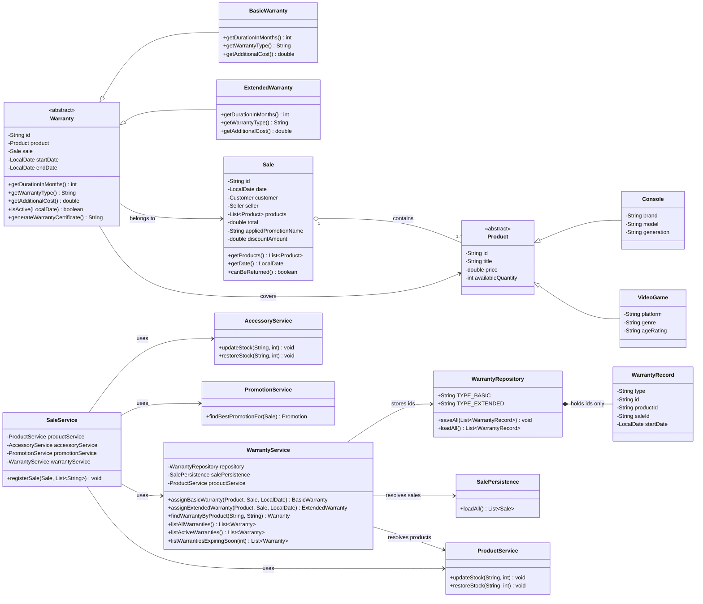

```mermaid
classDiagram
    direction LR

    class Warranty {
        <<abstract>>
        -String id
        -Product product
        -Sale sale
        -LocalDate startDate
        -LocalDate endDate
        +getDurationInMonths() int
        +getWarrantyType() String
        +getAdditionalCost() double
        +isActive(LocalDate) boolean
        +generateWarrantyCertificate() String
    }

    class BasicWarranty {
        +getDurationInMonths() int
        +getWarrantyType() String
        +getAdditionalCost() double
    }

    class ExtendedWarranty {
        +getDurationInMonths() int
        +getWarrantyType() String
        +getAdditionalCost() double
    }

    class Product {
        <<abstract>>
        -String id
        -String title
        -double price
        -int availableQuantity
    }

    class Console {
        -String brand
        -String model
        -String generation
    }

    class VideoGame {
        -String platform
        -String genre
        -String ageRating
    }

    class Sale {
        -String id
        -LocalDate date
        -Customer customer
        -Seller seller
        -List~Product~ products
        -double total
        -String appliedPromotionName
        -double discountAmount
        +getProducts() List~Product~
        +getDate() LocalDate
        +canBeReturned() boolean
    }

    class WarrantyRepository {
        +String TYPE_BASIC
        +String TYPE_EXTENDED
        +saveAll(List~WarrantyRecord~) void
        +loadAll() List~WarrantyRecord~
    }

    class WarrantyRecord {
        -String type
        -String id
        -String productId
        -String saleId
        -LocalDate startDate
    }

    class SalePersistence {
        +loadAll() List~Sale~
    }

    class WarrantyService {
        -WarrantyRepository repository
        -SalePersistence salePersistence
        -ProductService productService
        +assignBasicWarranty(Product, Sale, LocalDate) BasicWarranty
        +assignExtendedWarranty(Product, Sale, LocalDate) ExtendedWarranty
        +findWarrantyByProduct(String, String) Warranty
        +listAllWarranties() List~Warranty~
        +listActiveWarranties() List~Warranty~
        +listWarrantiesExpiringSoon(int) List~Warranty~
    }

    class SaleService {
        -ProductService productService
        -AccessoryService accessoryService
        -PromotionService promotionService
        -WarrantyService warrantyService
        +registerSale(Sale, List~String~) void
    }

    class ProductService {
        +updateStock(String, int) void
        +restoreStock(String, int) void
    }

    class AccessoryService {
        +updateStock(String, int) void
        +restoreStock(String, int) void
    }

    class PromotionService {
        +findBestPromotionFor(Sale) Promotion
    }

    Warranty <|-- BasicWarranty
    Warranty <|-- ExtendedWarranty

    Product <|-- Console
    Product <|-- VideoGame

    Warranty --> Product : covers
    Warranty --> Sale : belongs to

    Sale "1" o-- "1..*" Product : contains

    SaleService --> ProductService : uses
    SaleService --> AccessoryService : uses
    SaleService --> PromotionService : uses
    SaleService --> WarrantyService : uses

    WarrantyService --> WarrantyRepository : stores ids
    WarrantyService --> SalePersistence : resolves sales
    WarrantyService --> ProductService : resolves products
    WarrantyRepository *-- WarrantyRecord : holds ids only
```
